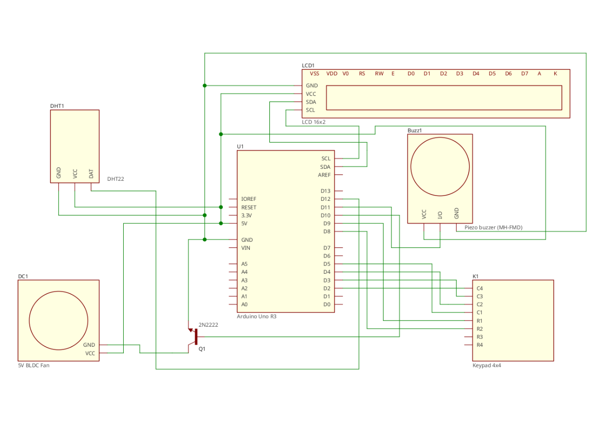

# Temperature Regulator System

This project implements a temperature regulator system using an Arduino microcontroller, a keypad, a LCD display, a DHT22 sensor for temperature and humidity measurement, and a DC fan with PWM control. The system allows users to monitor temperature, humidity, fan speed, and buzzer state on the LCD display. It also includes features such as debug mode, fan speed testing, and buzzer testing.

---

## Features

- Display temperature and humidity readings on the LCD display
- Control fan speed based on temperature
- Activate buzzer when humidity falls below a minimum threshold or exceeds a maximum threshold
- Debug mode for diagnostic information from the DHT22 sensor
- Testing modes for fan speed and buzzer functionality
- Set custom parameters for humidity and temperature limits

---

## Components Used

- Arduino microcontroller
- Keypad
- LCD display (with I2C interface)
- DHT22 temperature and humidity sensor
- 5V BLDC fan (with PWM control using a 2N2222 transistor)
- Piezo buzzer (MH-FMD)

---

## Usage

1. Connect all components according to the circuit diagram.
2. Upload the code to the Arduino microcontroller.
3. Use the keypad to navigate through different modes:
   - Press 1 to enter debug mode (temperature and humidity sensor diagnostic information).
   - Press 2 to toggle between displaying temperature/humidity and fan speed/buzzer state.
   - Press 3 to enter fan speed testing mode.
   - Press 4 to enter buzzer testing mode.
   - Press 5 to toggle debug mode.
   - Press 6 to set custom parameters for humidity and temperature limits.
   - Press 8 to clear the LCD display.
4. Monitor temperature, humidity, fan speed, and buzzer state on the LCD display.

---

## Circuit Diagram

---

## Pin Configurations

### Keypad Pins

- Row Pins: `R1` (Pin 9), `R2` (Pin 8)
- Column Pins: `C1` (Pin 5), `C2` (Pin 4), `C3` (Pin 3), `C4` (Pin 2)

### LCD Pins

- I2C Address: 0x27
- Data Pin: SDA
- Clock Pin: SCL

### Other Pins

- PWM Pin: 10
- Buzzer Pin: 11
- DHT22 Pin: 12

---

## Dependencies

- **Keypad**: Used for interfacing with the keypad (https://github.com/Chris--A/Keypad.git).
- **LiquidCrystal_I2C**: Controls the LCD via I2C communication (https://downloads.arduino.cc/libraries/github.com/marcoschwartz/LiquidCrystal_I2C-1.1.2.zip).
- **DHT22**: Enables reading data from the DHT22 sensor (https://github.com/dvarrel/DHT22.git).

---

## Macros

### Keypad Pins

- `R1`, `R2`: Pin numbers for keypad row connections.
- `C1`, `C2`, `C3`, `C4`: Pin numbers for keypad column connections.

### Keypad Dimensions

- `ROWS`, `COLS`: Number of rows and columns on the keypad matrix.

### LCD Configuration

- `i2cPort`: I2C address of the LCD display.
- `totalColumns`, `totalRows`: Number of columns and rows on the LCD display.

### Pin Numbers

- `PWM`, `BUZZ`, `DHT`: Pin numbers for PWM, buzzer, and DHT22 sensor.

### Debug and Timing

- `DEBUG_SERIAL_BAUDRATE`: Baud rate for serial communication in debug mode.
- `DEBOUNCE_TIME`: Debounce time for the keypad.
- `BUZZER_DELAY`: Delay time for the buzzer.
- `DELAY_IN_SETUP`: Delay on the end of `setup()`.
- `DHT_UPDATE_INTERVAL`: Interval for updating temperature and humidity readings from the DHT22 sensor.
- `FAN_SPEED_UPDATE_INTERVAL`: Interval for updating the fan speed based on temperature.

### Default Parameters

- `DEFAULT_HUMIDITY_MIN`, `DEFAULT_HUMIDITY_MAX`,`DEFAULT_TEMPERATURE_MIN`: Default minimum and maximum humidity limits and default minimum temperature limit.

### Humidity and Temperature Adjustment

- `HUMIDITY_MIN_LOWER_LIMIT`, `HUMIDITY_MIN_UPPER_LIMIT`: Lower and upper limits for adjusting the minimum humidity threshold.
- `HUMIDITY_MAX_LOWER_LIMIT`, `HUMIDITY_MAX_UPPER_LIMIT`: Lower and upper limits for adjusting the maximum humidity threshold.
- `TEMPERATURE_MIN_LOWER_LIMIT`, `TEMPERATURE_MIN_UPPER_LIMIT`: Lower and upper limits for adjusting the minimum temperature threshold.

### Adjustment Steps

- `HUMIDITY_STEP`, `TEMPERATURE_STEP`: Step sizes for adjusting the humidity and temperature thresholds.

---

## Variables

- **`action_state`**
  - **Type**: Enum
  - **Description**: Represents the current state of the system. Possible states include:
    - `NORMAL_DISPLAY`: Normal display mode for showing temperature and humidity readings.
    - `DEBUG_MODE`: Debug mode for displaying diagnostic information from the DHT22 sensor.
    - `FAN_TEST`: Fan speed testing mode.
    - `BUZZER_TEST`: Buzzer testing mode.

- **`display_state`**
  - **Type**: Boolean
  - **Description**: Controls whether the LCD display shows temperature and humidity readings (`true`) or fan speed and buzzer state (`false`).

- **`debug_enable`**
  - **Type**: Boolean
  - **Description**: Determines whether debug mode is enabled (`true`) or not (`false`), allowing for diagnostic information from the DHT22 sensor.

- **`humidity_min`**, **`humidity_max`**, **`temperature_min`**
  - **Type**: Unsigned 8-bit integer
  - **Description**: Define the minimum and maximum humidity thresholds (`humidity_min`, `humidity_max`) and the minimum temperature threshold (`temperature_min`) for the system.

- **`en_mill`**
  - **Type**: Unsigned long
  - **Description**: Stores the current time for timing purposes in the main loop.

---

## Functions

- **buzzControl(humidity)**: Checks if the humidity falls below the minimum threshold or exceeds the maximum threshold and activates the buzzer accordingly. Returns true if the buzzer is activated.

- **dcFanControl(temperature)**: Adjusts the fan speed based on the temperature. Returns the fan speed percentage.

- **display()**: Retrieves temperature and humidity readings from the DHT22 sensor, controls the fan speed and buzzer state, and displays the relevant information on the LCD display.

- **debugMode()**: Displays diagnostic information from the DHT22 sensor in debug mode.

- **action()**: Performs actions based on the current state of the system, including displaying normal information, entering debug mode, or performing fan and buzzer tests.

- **keypadEvent(key)**: Handles keypad events and performs corresponding actions based on the pressed key.

- **set_parameters()**: Allows users to set custom parameters for humidity and temperature thresholds using the keypad.

- **setup()**: Initializes the system, including setting up pins, LCD display, and initializing parameters.

- **loop()**: The main loop of the system, where actions are performed periodically based on timing intervals.

